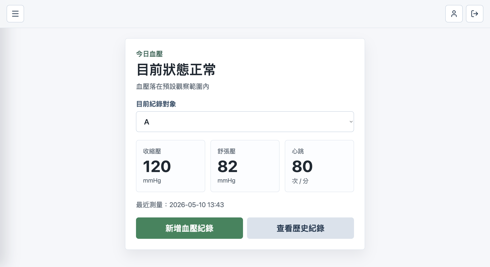
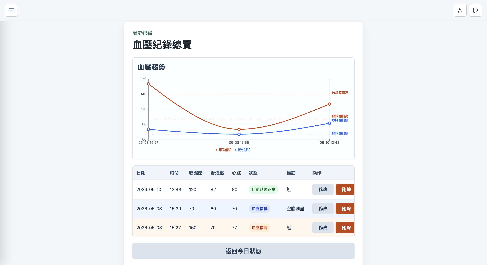
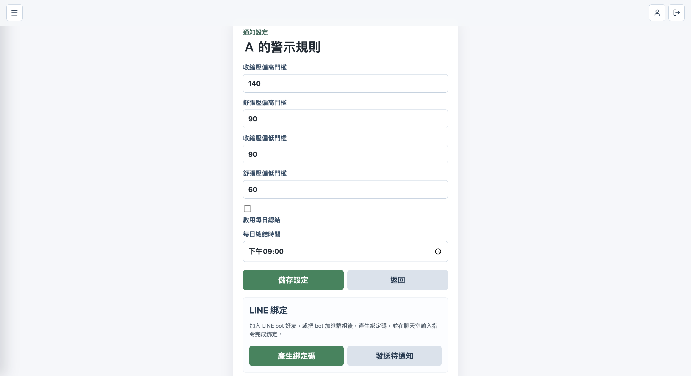
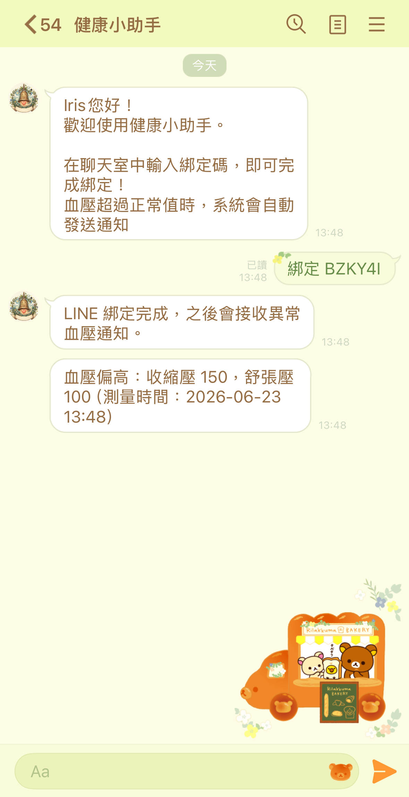
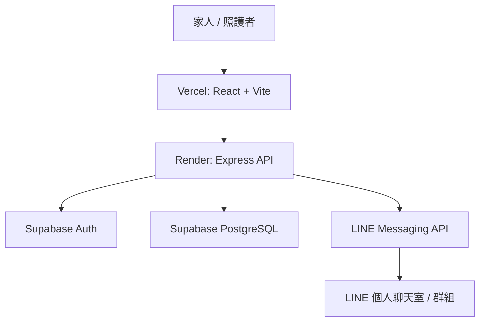
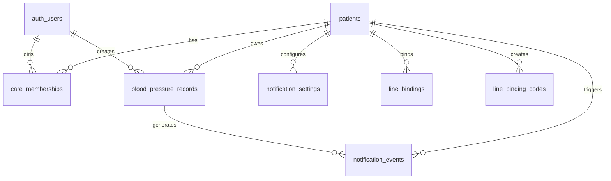
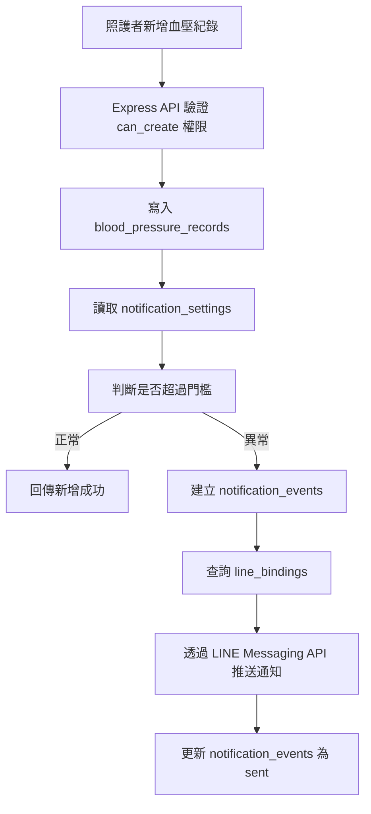
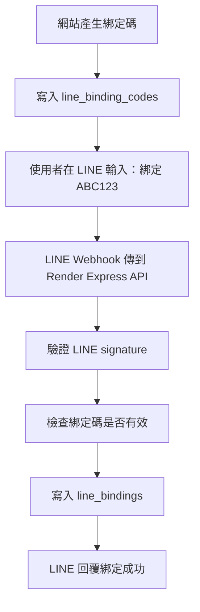

# 血壓照護紀錄系統

一個提供家人與照護者使用的血壓紀錄平台，
支援多人協作、權限管理與 LINE 異常通知。

## Screenshots

[網頁連結：https://blood-pressure-app-seven.vercel.app/](https://blood-pressure-app-seven.vercel.app/)

### Dashboard



### 血壓趨勢圖和歷史紀錄



### 通知設定



### LINE 通知



## 技術亮點

### 多照護者權限模型

同一位被照護者可能由多位家人共同照護，
因此系統使用 `care_memberships`
管理使用者與病患之間的關聯與操作權限，
支援查看、新增、修改、刪除與管理照護者等 granular permission。

### Row Level Security (RLS)

使用 Supabase RLS 保護資料存取。

Supabase Auth 負責驗證使用者身份，
RLS 則負責限制使用者可存取的病患資料，
避免未授權使用者直接存取他人紀錄。

### Express API + Service Role 保護

為避免 Supabase service role key 暴露於前端，
所有高權限操作皆透過 Express API 處理，
包含權限驗證、LINE webhook 與通知推送。

### LINE Messaging API 整合

使用 LINE webhook 與綁定碼機制，
支援 LINE 個人聊天室與群組綁定。

新增異常血壓紀錄後，
後端會自動推送通知給已綁定的照護者。

## 系統架構

```text
Frontend: Vercel
Backend: Render
Database/Auth: Supabase
Notification: LINE Messaging API
```



## 功能特色

- 血壓紀錄與歷史趨勢查詢
- 收縮壓 / 舒張壓圖表視覺化
- 多照護者共同管理
- 權限控制（CRUD / 通知 / 成員管理）
- LINE 異常通知推播
- LINE 個人與群組綁定

## 產品定位

本系統定位為「家人與照護者使用的血壓照護工具」。

被照護者通常不一定會直接操作系統，因此系統將：

- 被照護者（patient profile）
- 登入使用者（caregiver）

拆分設計，並透過 membership model 管理權限。

## 資料模型設計

- `patients`：被照護者檔案。
- `auth.users`：可登入系統的家人或照護者帳號。
- `care_memberships`：管理哪位使用者可以操作哪位被照護者資料，以及其權限。
- `blood_pressure_records`：血壓紀錄。
- `notification_settings`：異常血壓門檻設定。
- `notification_events`：異常通知事件。
- `line_binding_codes`：LINE 綁定碼。
- `line_bindings`：已綁定的 LINE 個人或群組目標。



> `auth_users` 對應 Supabase 的 `auth.users`。

## 主要流程

### 血壓紀錄與異常通知



### LINE 綁定



## 專案結構

```text
blood-pressure-app/
  src/
    api/                      # 前端 API request 封裝
    auth/                     # Supabase Auth client
    components/               # 共用元件
    pages/                    # 頁面元件
    utils/                    # 血壓狀態判斷等工具
    App.jsx                   # 前端主要狀態與頁面切換
    main.jsx                  # React 進入點
    style.css                 # 全站樣式
  server/
    src/
      index.js                # Express server 進入點
      recordsRouter.js        # 血壓紀錄 API
      patientsRouter.js       # 被照護者 API
      membersRouter.js        # 照護者權限 API
      settingsRouter.js       # 通知設定 API
      lineRouter.js           # LINE webhook / 綁定 API
      lineNotifications.js    # LINE 通知發送邏輯
      accessControl.js        # 權限檢查
      supabaseClient.js       # Supabase 後端 client
  database/
    migrations/               # Supabase SQL migrations
```
